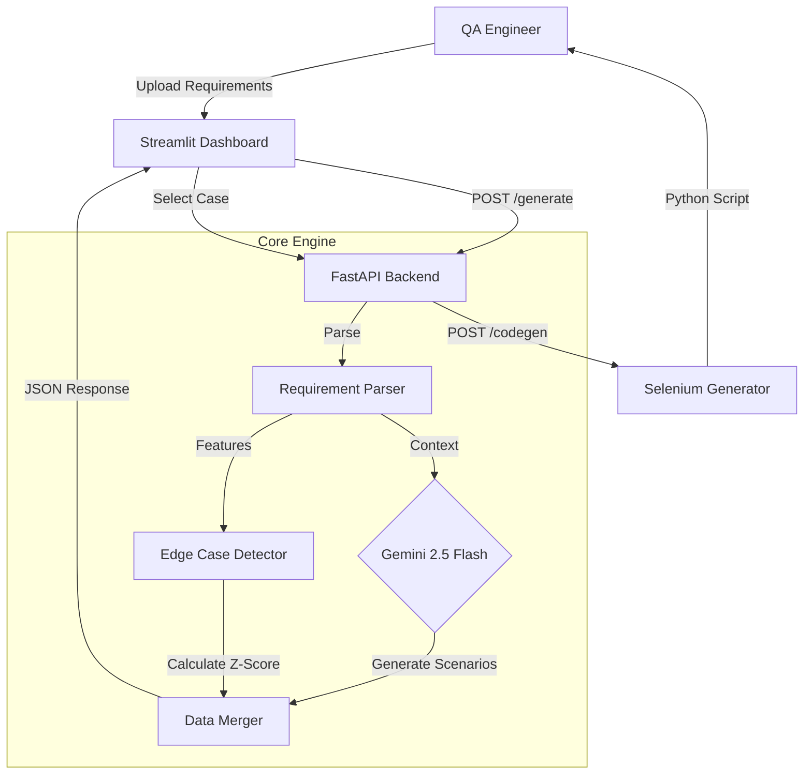

# 🏗️ Zeta AI - Architecture & System Design

**Version:** 1.0.0 (Production)
**Status:** Live on Hugging Face
**Core Engine:** Google Gemini 2.5 Flash + Scikit-Learn Isolation Forest

---

## 🎯 Project Overview
Zeta is an autonomous Quality Assurance (QA) Architect. Unlike standard test generators that rely solely on LLMs (hallucination-prone), TestForge enforces **Statistical Rigor**.

It parses software requirements, generates comprehensive test scenarios using **Chain-of-Thought (CoT)**, and then uses a **Physics-Informed ML Engine** to calculate the Z-Score complexity of every requirement. High-complexity requirements with low test coverage are flagged as **Critical Edge Cases**.

---

## 📁 Repository Structure

The codebase follows a modular **Microservice Monorepo** pattern, separating Core Logic, ML, API, and UI.

```text
Zeta-AI/
│
├── README.md                          # Project landing page
├── Dockerfile                         # "Double Agent" container (API + UI)
├── requirements.txt                   # Production dependencies
│
├── config/
│   └── prompts.yaml                   # Externalized SOTA System Prompts
│
├── src/
│   ├── api/                           # [The Nervous System]
│   │   ├── main.py                    # FastAPI Entry Point (Async)
│   │   └── models.py                  # Pydantic Data Contracts
│   │
│   ├── core/                          # [The Brain]
│   │   ├── llm_engine.py              # Gemini 2.5 Integration (Tenacity Retries)
│   │   ├── requirement_parser.py      # PDF/Text Ingestion
│   │   └── code_generator.py          # Jinja2 Selenium Template Engine
│   │
│   ├── ml/                            # [The Physics Engine]
│   │   ├── edge_case_detector.py      # Isolation Forest + Anomaly Logic
│   │   └── anomaly_detection.py       # Z-Score Statistical Calculator (Sentinel Port)
│   │
│   └── selenium_framework/            # [The Output Target]
│       └── base_test.py               # Base class for generated scripts
│
└── streamlit_app/                     # [The Face]
    └── app.py                         # Interactive Dashboard (4-Tab Layout)
```

---

## 🏗️ System Architecture

Zeta runs as a **Hybrid Microservice**. The FastAPI backend handles heavy compute (ML/LLM), while Streamlit handles User Interaction. Both run inside a single Docker container for easy deployment.



---

## 🧠 The Intelligence Pipeline

### 1. The Generative Layer (Gemini 2.5)
*   **Input:** Raw Requirement Text.
*   **Process:** Uses a **Few-Shot Chain-of-Thought** prompt (`config/prompts.yaml`) to decompose logic into Happy Paths, Negative Tests, and Security Scenarios.
*   **Output:** Structured JSON (Title, Steps, Preconditions).

### 2. The Physics Layer (ML Edge Case Detector)
*   **Problem:** LLMs are bad at judging "Risk."
*   **Solution:** We quantify complexity using Feature Engineering.
    *   *Features:* Text Length, Conditional Logic Density ("IF", "UNLESS"), Strictness ("MUST"), Error handling keywords.
*   **Algorithm:**
    1.  **Isolation Forest:** Identifies outliers in the requirement set (Inductive).
    2.  **Z-Score (Sentinel Engine):** Calculates standard deviation from the mean complexity (Deductive).
    3.  **Risk Flag:** If `Z-Score > 2.5` OR `Anomaly = -1`, the requirement is flagged as **CRITICAL**.

### 3. The Execution Layer (Code Gen)
*   **Template:** Uses **Jinja2** to map abstract test steps into a **Page Object Model (POM)** structure.
*   **Output:** Executable `pytest` scripts ready for local execution.

---

## 📊 Data Flow & Contracts

All internal communication strictly follows **Pydantic Schemas** to prevent data corruption.

1.  **Request:** `GenerateRequest(text: str)`
2.  **LLM Output:** List of Dicts (Raw Test Cases)
3.  **ML Analysis:** List of `RequirementAnalysis` Objects (Risk Scores)
4.  **Merge:** The API injects `risk_analysis` into the original Test Case JSON.
5.  **Response:** `TestSuiteResponse(test_cases: List[TestCase], meta: Dict)`

---

## 📦 Production Stack (2026 Standards)

| Component | Technology | Justification |
| :--- | :--- | :--- |
| **API** | **FastAPI** | Async support for concurrent ML/LLM processing. |
| **LLM** | **Google Gemini 2.5** | 1M Context Window for reading massive requirement docs. |
| **ML** | **Scikit-Learn** | Lightweight, robust statistical modeling. |
| **Templating** | **Jinja2** | Prevents code injection during script generation. |
| **Validation** | **Pydantic** | Enforces strict type safety across the pipeline. |
| **Visualization** | **Altair** | Renders interactive risk heatmaps in the UI. |
| **Container** | **Docker (Slim)** | Multi-process container running Uvicorn + Streamlit. |

---

## ⚠️ Known Limitations
*   **Selenium Execution:** The system *generates* code but does not *execute* it in the cloud (to prevent resource exhaustion). Users download scripts to run locally.
*   **Visual QA:** Currently supports text-based requirements only. Diagram parsing (Flowcharts) is on the roadmap.
```
